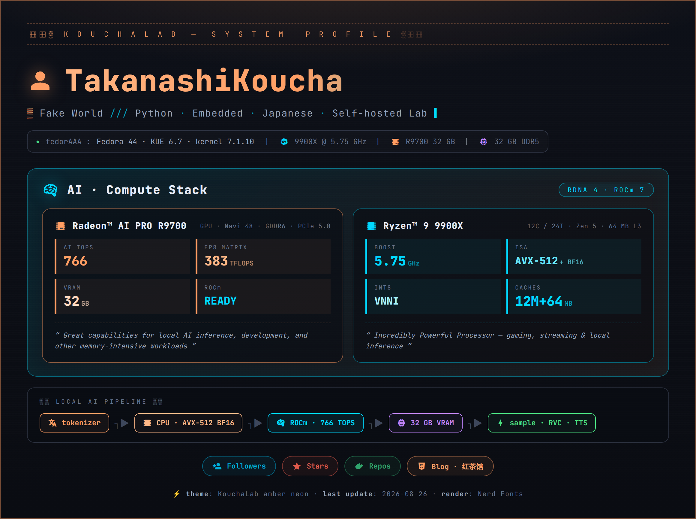
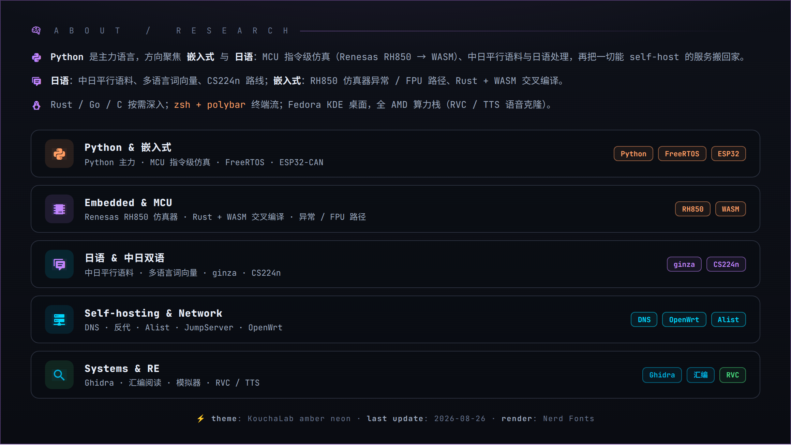

 

 

**AMD Ryzen 9 9900X** · 12C/24T Zen 5 · 5.75 GHz · AVX-512 + BF16 + VNNI 
**Radeon AI PRO R9700** · RDNA 4 (Navi 48) · **766 TOPS** AI 算力 · FP8 383 TFLOPS · 32 GB GDDR6 · PCIe 5.0 
**32 GB DDR5** · ZRAM 8 GB · Swap 40 GB 
**Fedora 44** · KDE Plasma 6.7 · kernel 7.1.10 · ROCm 7 · self-hosted lab

